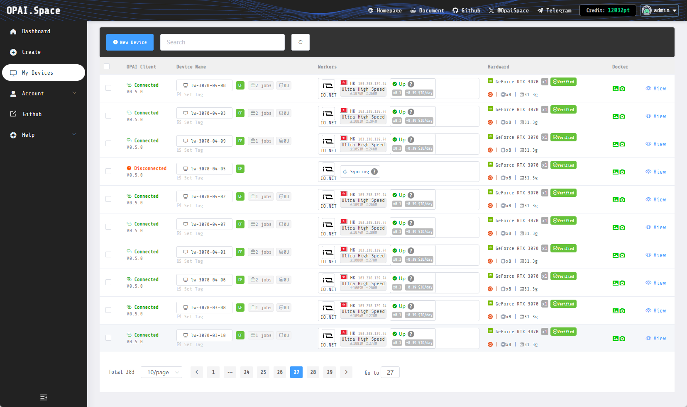

# 🖐️ OPAI.Space Overview

> OPAI is a DEPIN aggregation platform. We help users quickly become [IO.NET](http://io.net/) worker.
>
> * **Deploy/Manage DEPIN devices**\
>   If you have a device, run the OPAI client on it, then you can deploy/manage/share [IO.NET](http://io.net/) worker nodes on the OPAI webpage.

> * **Apply for free trial device**\
>   If you don’t have any devices, you also can apply for our free credits in the discord community. This is a GPU cluster we built, designed for new user experience and evaluation as an [IO.NET](http://io.net/) worker. The device will consume users credits on a per-second basis.\
>   No complicated setup is required, and it only takes a few minutes to spin up your worker nodes.

<figure><figcaption>
OPAI.Space Dashboard
</figcaption></figure>

OPAI is currently under rapid development and we will frequently update more features.

## Contact us


Twitter: [@OpaiSpace](https://x.com/OpaiSpace)



Telegram: [Offical Telegram](https://t.me/+Ybz0mG3pwJ0wOTA1)


